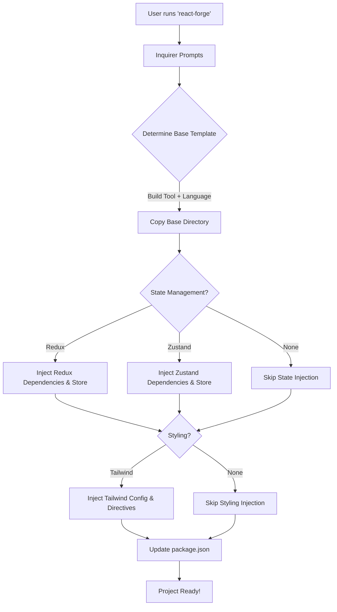

# React Forge Architecture

React Forge is built on a dynamic template-stitching architecture. Instead of maintaining dozens of monolithic templates for every possible combination (e.g., Vite+TS+Redux+Tailwind), it uses a modular approach.

## Generation Flow

## Directory Structure

- `bin/cli.js`: The executable entry point.
- `lib/prompts.js`: Interactive terminal prompts using `inquirer`.
- `lib/generator.js`: The core logic that orchestrates file copying and JSON mutation.
- `templates/`:
  - `vite-js/` / `vite-ts/`: Base React setups powered by Vite.
  - `webpack-js/` / `webpack-ts/`: Base React setups powered by a fully exposed Webpack config.
  - `state/`: Sub-modules for Redux and Zustand.
  - `styling/`: Sub-modules for Tailwind configuration.

## Injection Mechanism

1. **File Copying**: Base templates are copied directly using `fs-extra`.
2. **Dependency Mutation**: The generated `package.json` is read into memory, modified (dependencies added based on user choices), and written back.
3. **AST/String Replacement**: For specific files like `main.jsx` (when adding Redux's `<Provider>`), the generator performs targeted string replacements to wrap the core application tree dynamically.
